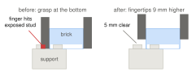
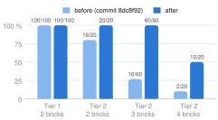

<div class="abstract">
**Abstract.** We model the LEGO assembly tasks of WorkBenchMark tiers 1 and 2 in PDDL, solve them with a general-purpose planner and execute the plans in MuJoCo through TAMPanda's `DomainBridge`. A STRIPS domain with seven predicates and three actions yields a valid, optimal plan for all 200 tasks. Execution succeeds for 100 of 100 tier 1 tasks and 90 of 100 tier 2 tasks. The symbolic model is sufficient to order these structures, but whether a plan can be executed is decided by geometry the model does not contain: finger clearance at the target, placement precision and static stability. In every remaining failure the centre of mass of a brick lies on or beyond the edge of its support. Real LEGO holds such structures by the stud clutch, which the simulation interface available to us does not model.
</div>

# 1 Task and scope

WorkBenchMark [1] defines 400 LEGO Duplo assembly tasks in four tiers. A task is a YAML file with the target pose of every brick; the robot has to pick the bricks from a pick area and build the structure in an assembly area. The paper solves the tasks with an Assembly-by-Disassembly (ABD) planner. This project takes the other route: a hand-written PDDL domain, an off-the-shelf planner, and the question of where the symbolic abstraction has to be patched by geometry.

As proposed, we restrict ourselves to tier 1 (two bricks) and tier 2 (two to four bricks) with 100 tasks each, to simulation, and to ground-truth brick poses instead of perception. The simulation environment of WorkBenchMark was not available during the project. We use `lego_sim` [2], a MuJoCo simulator by the first author of [1], through its direct Python interface. It spawns the bricks at seeded random poses, exposes position control of a Panda arm with a parallel gripper and scores the final state: a task succeeds if every brick lies within 6 mm (horizontal), 4 mm (vertical) and 8° (yaw, up to the symmetry of the brick) of its target.

# 2 Approach

`parser.py` writes a PDDL problem from the task file, `upf.py` plans, `bridge.py` executes the plan step by step through `DomainBridge`, and `lego_sim` scores the result.

**Domain.** There is one type, `brick`, and seven predicates: `on_brick(b1,b2)`, `on_table(b)`, `clear(b)`, `holding(b)`, `pick_area(b)`, `assembly_area(b)` and `hand_empty`. Three actions change them:

```
pick(b)       pre: hand_empty, pick_area(b)
              eff: holding(b), not pick_area(b), not hand_empty, not on_table(b)
place(b)      pre: holding(b)
              eff: on_table(b), assembly_area(b), hand_empty, not holding(b)
stack(b1,b2)  pre: holding(b1), clear(b2), assembly_area(b2)
              eff: on_brick(b1,b2), assembly_area(b1), hand_empty, not holding(b1), not clear(b2)
```

**Problem.** Initially every brick is `on_table`, `clear` and in the `pick_area`, and the hand is empty. The goal asks for `assembly_area(b)` for every brick, `on_table(b)` for the bricks of the lowest layer, and `on_brick(a,b)` for every pair of bricks whose heights differ by exactly one layer. No coordinate enters the problem file.

**Planner.** We use the breadth-first forward search from the course exercises. The Unified Planning Framework (UPF) [3] parses the two PDDL files; our code grounds the actions and searches the state space. It returns shortest plans. The same files are also solved with Fast Downward and pyperplan through UPF (Section 3.2).

**Execution.** Every PDDL action is registered with `DomainBridge` as an executor that runs a motion routine and returns whether it succeeded together with the effects of the action. `DomainBridge` tracks the symbolic state through these effects, checks the PDDL preconditions before every step, and execution stops at the first action that fails. The geometry comes from the task file. `pick` takes a top-down grasp orientation from TAMPanda's `GraspPlanner`, preferring the one that closes across the 32 mm side of the brick, and rejects it if another brick lies in the finger corridor. `place` and `stack` move 15 cm above the target, measure the actual pose of the brick in the hand, correct for it, descend, open the gripper and retreat; `stack` expresses the target relative to the measured pose of the supporting brick.

# 3 Evaluation

## 3.1 Setup and main result

All 200 tasks were run with `evaluate.py`, one process per task, instead of the 20 per tier suggested in the project description. `lego_sim` (commit `326d572`, MuJoCo 3.11) draws the initial brick layout from a seed; we use seed 42. We report the metrics of the proposal: planning success rate p/n, execution success rate e/p, planning time and plan length. Planning time covers reading the PDDL files, grounding and search; it excludes writing the problem file and the one-off start-up of the PDDL library (about 0.5 s per process). Execution success is the verdict of the benchmark on the final assembly.

| | Tier 1 | Tier 2 |
|:--|:--|:--|
| Tasks n (bricks per task) | 100 (2) | 100 (2–4) |
| Planning success p/n | 100/100 | 100/100 |
| Plan length, actions | 4 | 6.0 (4–8), always 2 per brick |
| Planning time, mean (maximum) | 19 ms (29 ms) | 52 ms (158 ms) |
| **Execution success e/p** | **100/100** | **90/100** |
| by number of bricks | 2: 100/100 | 2: 20/20, 3: 60/60, 4: 10/20 |
| Bricks within tolerance | 100 % | 93.3 % |
| Largest error of a brick in successful runs | 0.2 mm, 0.4° | 2.7 mm, 2.7° |
| Simulated time per task, mean | 339 s | 508 s |
| Execution success before the fixes of Sec. 3.3 | 100/100 | 34/100 |

: Table 1: Results on all 200 tasks of tiers 1 and 2.

Every plan is found and optimal. Planning is not the bottleneck in these tiers; execution is. The simulated time per task exceeds the 300 s episode timeout that `lego_sim` configures for its ROS interface (the Python interface does not enforce it), because our motions hold every waypoint for 0.4 s. With motions 2.5 times faster a test set of 16 tasks was solved with similar accuracy in 138 s and 198 s; we did not repeat the full evaluation at that speed.

## 3.2 Planner comparison

Table 2 compares our search with two UPF engines and with the ABD planner that ships with `lego_sim`, which derives an assembly order from the target geometry by reverse disassembly and needs no PDDL. All four solve all 200 tasks, all plans are optimal, and all four return the same assembly order for every task. In these tiers a PDDL planner has no advantage in solution quality over ABD, and it is slower: ABD needs 0.8 ms, pyperplan 1.3 to 2.3 ms and Fast Downward 77 ms, which is process start-up, each of the latter plus 27 ms for reading the PDDL files. Our blind search takes about eight times longer for every additional brick (1.5, 11.5, 100 ms); at that rate six bricks would take seconds and eight bricks minutes. The paper reports 6.9 s and 10.4 s of planning time for its ABD pipeline in tiers 1 and 2 [1]; those numbers include perception and motion planning and cannot be compared with ours.

| Planner | Solved | Optimal | 2 bricks | 3 bricks | 4 bricks |
|:--|:--|:--|:--|:--|:--|
| Breadth-first search (ours) | 200/200 | 200/200 | 1.5 ms | 11.5 ms | 100.0 ms |
| Fast Downward (UPF) | 200/200 | 200/200 | 76.4 ms | 76.9 ms | 77.8 ms |
| pyperplan (UPF) | 200/200 | 200/200 | 1.3 ms | 1.5 ms | 2.3 ms |
| ABD, `lego_sim` reference | 200/200 | 200/200 | 0.8 ms | 0.8 ms | 0.8 ms |

: Table 2: Median solve time by number of bricks (three repetitions per task). Reading the two PDDL files adds 27 ms for the first three planners.

## 3.3 Failure analysis: why tier 2 failed at first

The first complete version of the pipeline solved 100/100 tier 1 tasks but only 34/100 tier 2 tasks, and 22 tier 2 runs ended with an error. The plans were correct in every case. Tracing brick poses and contacts through the phases of each action exposed five causes, all in execution:

1. **A frame mismatch in the grasp.** `GraspPlanner` returns poses of TAMPanda's attachment site, which lies 9 cm below the hand origin along the tool axis. Our inverse kinematics controls the hand origin of the `lego_sim` model. The arm was therefore commanded 6 cm below the table and gripped every brick at its very bottom, with the fingertips pressed onto the table. When such a brick is stacked on a larger or laterally offset support, a fingertip lands on the exposed studs of the support (Fig. 1). The brick stays 4 mm above its seat, the position-controlled arm keeps pushing, and the tower is levered off the plate. In 21 runs MuJoCo then ran out of memory for the contacts. Tasks in which a finger ends up above the support succeeded in 6 of 51 cases, all others in 28 of 49. We now set the hand 103.4 mm above the brick origin, the height that follows from the parameters of the reference executor of `lego_sim`; it keeps the fingertips 5 mm clear of the studs.
2. **Placement precision.** The inverse kinematics accepted 2 mm of position error, and the pose of the brick in the hand was measured and corrected only once, 15 cm above the target; during the descent the brick shifts in the grasp by another 1 to 2 mm. The tolerance is now 0.2 mm, and the brick is measured and corrected a second time 8 mm above its seat. In tier 1 the largest horizontal error of a placed brick fell from 2.2 mm to 0.2 mm.
3. **No stud clutch.** The Python interface of `lego_sim` simulates contact only; the clutch that holds real LEGO exists in its ROS bridge but not here. A brick that overlaps its support by half has its centre of mass exactly above the edge of the shared area. Studs leave 2.8 mm of lateral play and the benchmark tolerates 6 mm, so such a brick is now placed 2.5 mm towards its support. It must also not be pressed: the position-controlled arm answers 1 mm of overtravel with about 40 N, and on a half-supported brick this force acts outside the studs the brick rests on. It tilts the brick into the edge of its support, where the contact solver produced forces above 30 kN and ejected the brick. Bricks are now lowered onto their seat without overtravel.
4. **Twist in the grasp.** A brick lags about 3 % behind every rotation of the wrist (4.7° for 150°, independent of grip force and grasp height, and reversible) and wedges between the fingers. Opening the gripper at once released this tension as a spin of up to 7° on the studs. Bricks are now placed in the symmetry-equivalent orientation with the shortest joint path, and the gripper opens along a ramp.
5. **Silent failures.** An unreachable grasp returned silently and crashed a later step; a zero-length motion divided by zero. Executors now report failure to `DomainBridge`.

<div class="figrow">
<figure><figcaption>Figure 1: Side view of an offset stack, to scale. Gripping at the bottom puts a fingertip on a stud of the support.</figcaption></figure>
<figure><figcaption>Figure 2: Execution success before and after the fixes, by tier and number of bricks.</figcaption></figure>
</div>

## 3.4 What the environment permits

Ten tier 2 tasks still fail. To separate our shortcomings from those of the environment, `static_stability.py` places all bricks of a target exactly on their poses without any robot and lets the simulation run. All tier 1 targets stand. Of the tier 2 targets, 8 collapse by themselves. The outcome follows from a margin that needs only the task file: the distance from the centre of mass of all bricks above a joint to the edge of the area shared by the two bricks at that joint (Table 3).

| Support margin of the target | Tasks | Stands when placed exactly | Assembled by our pipeline |
|:--|:--|:--|:--|
| positive, 10 to 16 mm | 44 | 44/44 | 44/44 |
| zero: centre of mass above the edge | 52 | 48/52 | 46/52 |
| negative, −5.6 to −8 mm | 4 | 0/4 | 0/4 |

: Table 3: Tier 2 targets by static support margin.

Every structure with a positive margin is built, and so is every tier 2 structure with two or three bricks. The ten failures are four-brick towers with a margin of zero or below, and all fall when the fourth brick is stacked. Seven of them collapse even when placed exactly; the other three stand when placed exactly. Conversely, the bias lets the pipeline build one structure (task 076) that collapses when placed exactly on target. These are the structures that real LEGO holds by its stud clutch.

## 3.5 Robustness and ablation

Tuning on one initial layout is misleading. An intermediate version that pressed every brick by 1 mm solved 19 of the first 20 tier 2 tasks with seed 42 but only 15 with seed 0; the two runs were identical to 0.01 mm up to the simulation step in which the press destabilised the brick. Table 4 therefore uses four seeds. With the final pipeline the result varies by at most one task between the layouts; the failures are task 020, whose margin is negative, and in two layouts task 009. Removing the stability bias costs 28 of 80 runs. The press and the second correction matter less on average, but each makes the result depend on the layout. For the three seeds other than 42, the first 20 tasks of each tier give 60/60 in tier 1 and 56/60 in tier 2.

| Variant (first 20 tier 2 tasks) | Seed 0 | Seed 1 | Seed 2 | Seed 42 | Total |
|:--|:--|:--|:--|:--|:--|
| Full pipeline | 19/20 | 18/20 | 19/20 | 18/20 | 74/80 |
| with 1 mm press | 15/20 | 19/20 | 19/20 | 19/20 | 72/80 |
| without second correction above the seat | 15/20 | 18/20 | 19/20 | 18/20 | 70/80 |
| without stability bias | 8/20 | 13/20 | 12/20 | 13/20 | 46/80 |

: Table 4: Execution success of tier 2 for four initial layouts.

# 4 What the PDDL model specifies and what it leaves out

**Granularity.** The domain distinguishes only the pick area, the assembly area and which brick is on which. That is enough for tiers 1 and 2, because all 200 targets are single columns: `on_brick` and `clear` admit exactly one order, bottom-up, and the planner finds it without any sequencing constraint supplied from outside. Stud positions do not change the plan. In tier 2, 83 of 100 tasks contain a lateral offset of one stud, and their plans are identical to those of centred stacks of the same height. The offset, the yaw and the grasp live entirely in the bridge, which reads them from the task file.

**Under-specification.** Because of this, the model admits plans that cannot be executed, and the evaluation shows three kinds. It knows nothing about finger clearance at the target, which caused most of the initial failures. It knows nothing about stability: the planner returns a plan for all four structures with a negative support margin. And it has no notion of reachability or precision. The first two can be decided from the task file before planning. A static fact per brick pair, computed by the parser from the support margin and required by `stack`, would turn the four impossible tasks into planning failures instead of execution failures; finger clearance depends on the gripper and is better kept as an external check. A further gap is structural: `place` may put any brick on the plate, and as there is no action that picks a brick up again, the state space contains dead ends that a blind search has to enumerate.

**Over-specification.** `pick_area`, `assembly_area` and `on_table` encode one location attribute with three predicates. The goal rule is stricter than contact: it asserts `on_brick` for every pair of bricks one layer apart, whether they touch or not. For single columns the two coincide. Beyond them they do not, and the domain itself reaches its limit: `stack` gives a brick exactly one support and `clear` allows one brick per support. In tiers 3 and 4, every one of the 200 targets contains a brick that rests on more than one support, so none of them can be expressed. Fast Downward and pyperplan accordingly return no plan for any of the first 20 tasks of tiers 3 and 4, and our search hits a 15 s limit on 30 of these 40.

# 5 Limitations and conclusion

The results hold for one simulator interface without stud clutch and for ground-truth poses. Parameters of the execution layer were chosen on the same tasks that we report, although on four initial layouts. The comparison with the ABD results of the paper is indirect, because the environments differ.

Within these limits the answer to the project question is clear. For structures of this size, a small STRIPS model and any planner produce the correct and optimal assembly order, identical to that of ABD. What decides success is below the symbolic level, and the most useful geometric information, clearance and stability, can be computed from the task description and fed back into the model as static facts or external checks. The boundary of the abstraction is not the planner but the vocabulary: single support and single load per brick carry exactly as far as tier 2.

<div class="note">
**Reproduction.** All result tables and the scripts that produce them are in the repository (`evaluation/`, `Project/`). **Use of AI tools.** Parts of the execution layer, the diagnosis of the execution failures, the evaluation scripts and the text of this report were produced with an LLM-based coding assistant; all numbers come from running the code in this repository.

**References.** [1] W. Ma, D. Swoboda, M. Tschesche, T. Hofmann: WorkBenchMark: A LEGO-Based Assembly Benchmark with an Assembly-by-Disassembly Baseline for the Smart Manufacturing League. RoboCup 2026, arXiv:2606.19358. [2] W. Ma: lego_sim, github.com/ma-haha-hehe/lego_sim. [3] Unified Planning Framework, github.com/aiplan4eu/unified-planning. [4] D. Swoboda: TAMPanda, task and motion planning for the Franka Panda.
</div>
